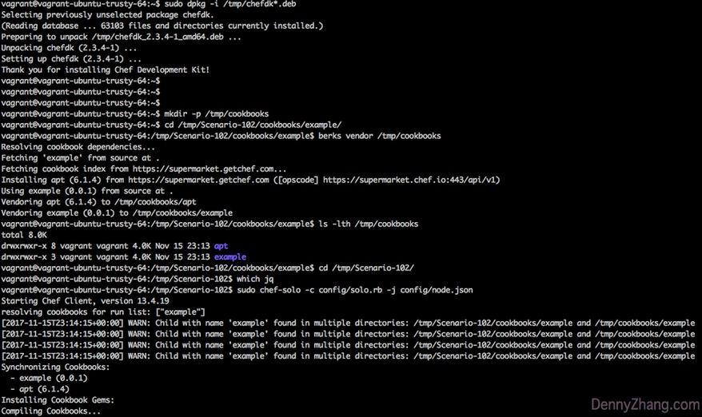

[](https://www.linkedin.com/in/dennyzhang001) [](https://www.dennyzhang.com/slack) [](https://github.com/DennyZhang)

File me [tickets](https://github.com/DennyZhang/chef-study/issues) or star [the repo](https://github.com/DennyZhang/chef-study).

<a href="https://github.com/DennyZhang?tab=followers"></a>

Table of Contents
=================

   * [Requirements](#requirements)
   * [Procedure](#procedure)
   * [Test in public cloud?](#test-in-public-cloud)


<a href="https://www.dennyzhang.com"></a>

# Requirements
1. Start a VM, install chef facility
2. Create a dummy cookbook to install jq package
3. Before install jq, run "apt-get update" by chef. So you need berkshelf.
4. Enforce rubocop and foodcritic for code static check

# Procedure
- Start VM via vagrant
```
vagrant up
```
More about virtualbox: https://www.virtualbox.org/wiki/Downloads

More about vagrant: https://www.vagrantup.com/docs/providers/basic_usage.html

- Login and install chef-dk
```
ssh vagrant@192.168.50.10
# password: vagrant

# https://downloads.chef.io/chefdk
wget -O /tmp/chefdk.deb \
     https://packages.chef.io/files/stable/chefdk/2.3.4/ubuntu/16.04/chefdk_2.3.4-1_amd64.deb

sudo dpkg -i /tmp/chefdk*.deb

# chef-solo version: 13.4.19
chef-solo -verison
```

- Upload chef cookbook code
```
scp -r Scenario-102 vagrant@192.168.50.10:/tmp/
```

- Get cookbooks dependency
```
ssh vagrant@192.168.50.10
mkdir -p /tmp/berks_cookbooks
cd /tmp/Scenario-102/cookbooks/example/
berks vendor /tmp/berks_cookbooks
ls -lth /tmp/berks_cookbooks

cd /tmp/Scenario-102/
```

- Apply Chef update
```
ssh vagrant@192.168.50.10
cd /tmp/Scenario-102

# Before chef deployment, our VM doesn't have jq package
which jq
sudo chef-solo -c config/solo.rb -j config/node.json

# After deployment, we should see jq package installed
which jq
```

- Run code static check
rubocop:
```
gem install rubocop -v "0.44.1"
cd cookbooks/example
rubocop .
```
Check more about rubocop: https://www.dennyzhang.com/rubocop_errors

foodcritic:
```
gem install foodcritic -v "4.0.0"
cd cookbooks/
foodcritic example
```

TODO: how to install foodcritic in mac OSX

- Destroy local vm
```
vagrant destroy -f
```

# Test in public cloud?

Now you have finished local VM deployment. Congratulations!

Why not move to public cloud? AWS, AZure, or whatever. Should be easy for you, right?
<a href="https://www.dennyzhang.com"></a>